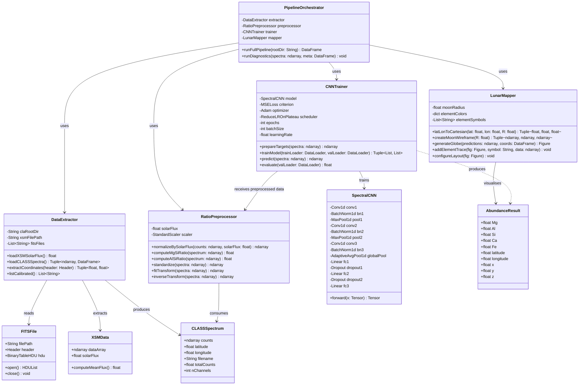
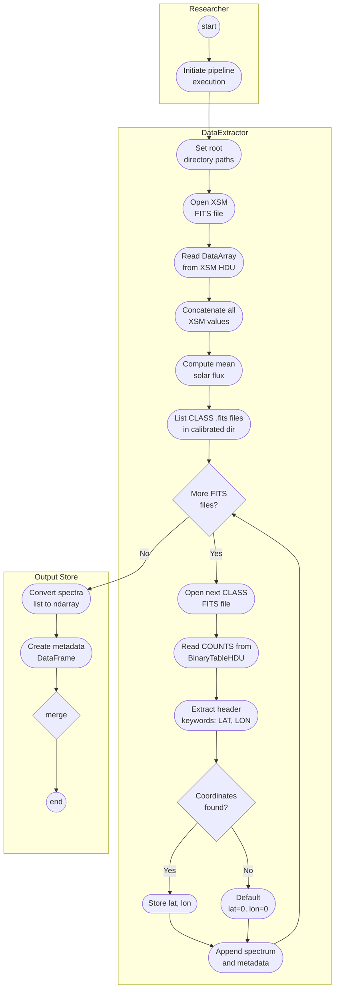
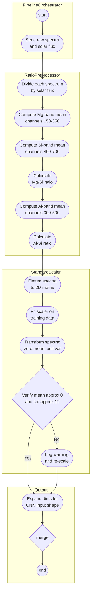
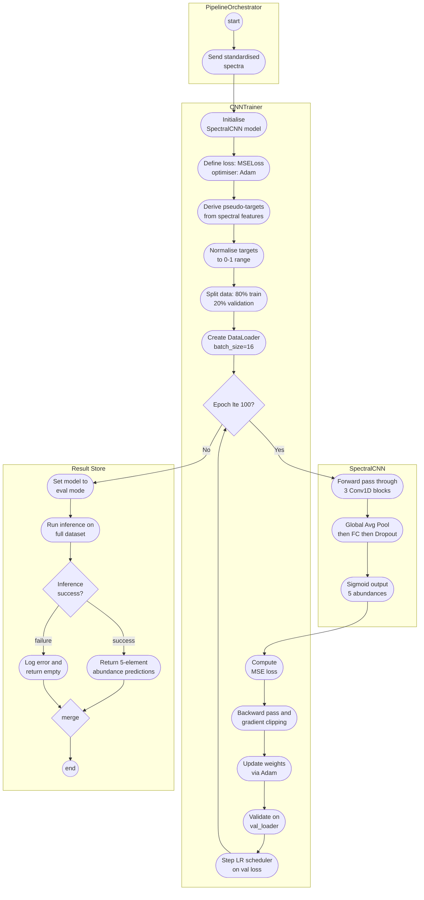
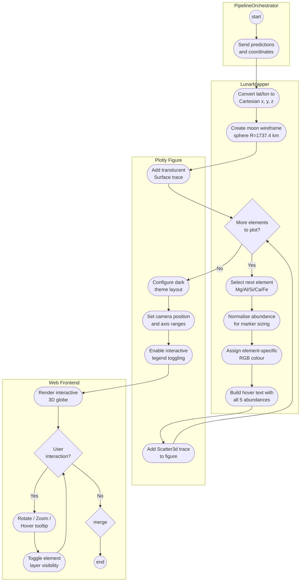
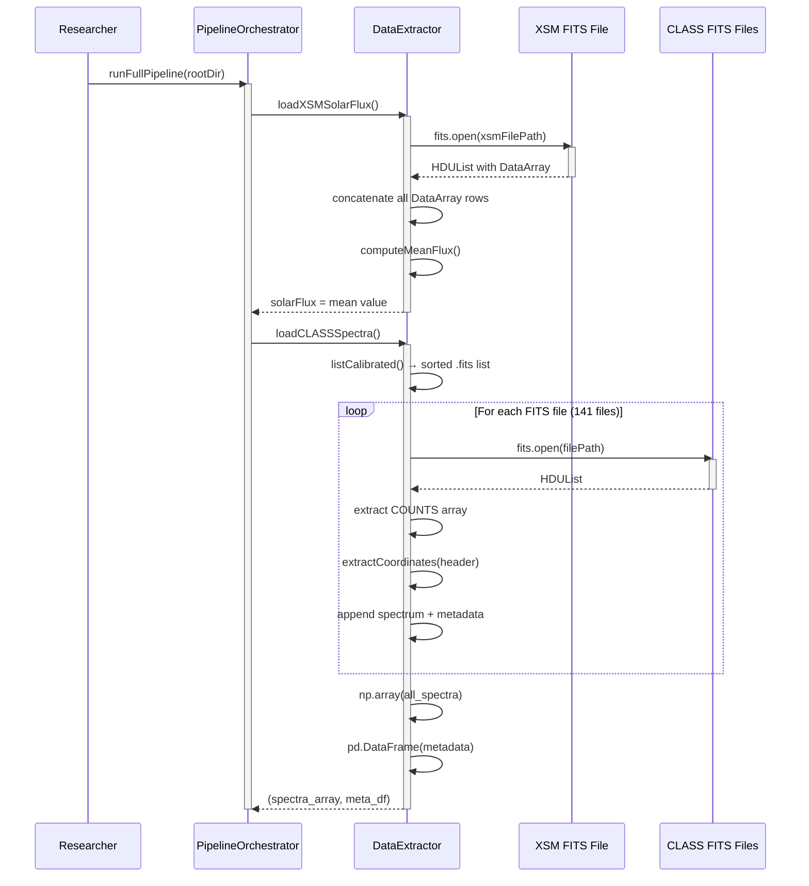
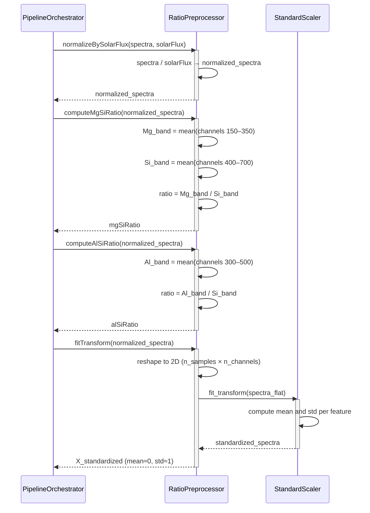
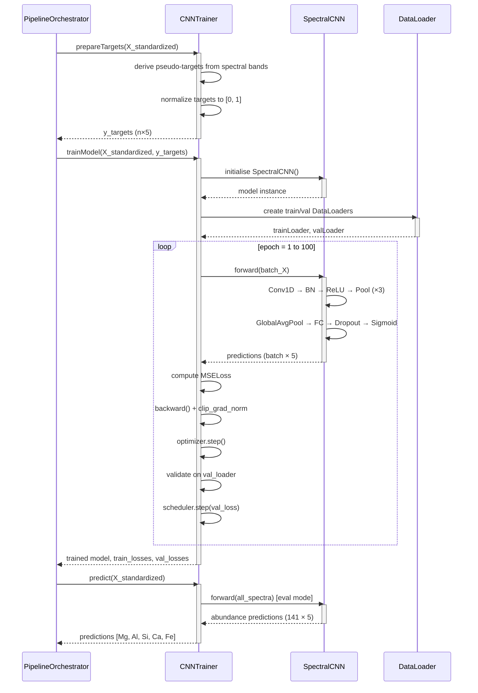
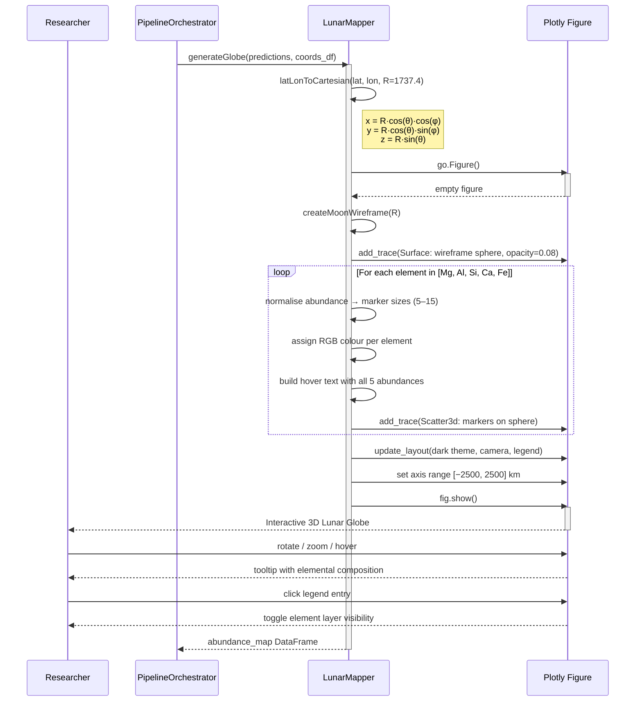

# Chandrayaan-2 CLASS Pipeline — UML Diagrams (Mermaid / StarUML)

---

## 1. Class Diagram (Entire System)

---

## 2. Use-Case Diagram (Entire System)

```mermaid
flowchart TB
    subgraph Actors
        Researcher(["🧑‍🔬 Planetary Scientist"])
        System(["⚙️ Pipeline System"])
        ISSDC(["🛰️ ISSDC Data Archive"])
    end

    subgraph UC_DataExtraction["Module: Data Extraction"]
        UC1["UC-1: Load CLASS L1 FITS Spectra"]
        UC2["UC-2: Load XSM Solar Flux"]
        UC3["UC-3: Extract Lat/Lon Coordinates"]
        UC4["UC-4: Validate FITS Headers"]
    end

    subgraph UC_Preprocessing["Module: Ratio Preprocessing"]
        UC5["UC-5: Normalise by Solar Flux"]
        UC6["UC-6: Compute Mg/Si Ratio"]
        UC7["UC-7: Compute Al/Si Ratio"]
        UC8["UC-8: Standardise Spectra"]
    end

    subgraph UC_CNN["Module: CNN Inference"]
        UC9["UC-9: Train 1D-CNN Model"]
        UC10["UC-10: Predict Elemental Abundances"]
        UC11["UC-11: Evaluate Model Performance"]
        UC12["UC-12: Denoise Spectral Signal"]
    end

    subgraph UC_Mapping["Module: Lunar Mapping"]
        UC13["UC-13: Project Abundances to 3D Globe"]
        UC14["UC-14: Interact with 3D Visualisation"]
        UC15["UC-15: Toggle Element Layers"]
        UC16["UC-16: Inspect Point-wise Composition"]
        UC17["UC-17: Run Diagnostic Analysis"]
    end

    Researcher --> UC1
    Researcher --> UC9
    Researcher --> UC13
    Researcher --> UC14
    Researcher --> UC15
    Researcher --> UC16
    Researcher --> UC17

    ISSDC --> UC1
    ISSDC --> UC2

    System --> UC3
    System --> UC4
    System --> UC5
    System --> UC6
    System --> UC7
    System --> UC8
    System --> UC10
    System --> UC11
    System --> UC12

    UC1 -.->|includes| UC3
    UC1 -.->|includes| UC4
    UC5 -.->|includes| UC2
    UC6 -.->|extends| UC5
    UC7 -.->|extends| UC5
    UC10 -.->|includes| UC12
    UC13 -.->|includes| UC10
```

---

## 3. Activity Diagrams (Module-wise)

### 3.1 Activity Diagram — Data Extraction Module

### 3.2 Activity Diagram — Ratio Preprocessing Module

### 3.3 Activity Diagram — CNN Inference Module

### 3.4 Activity Diagram — Lunar Mapping Module

---

## 4. Sequence Diagrams (Module-wise)

### 4.1 Sequence Diagram — Data Extraction Module

### 4.2 Sequence Diagram — Ratio Preprocessing Module

### 4.3 Sequence Diagram — CNN Inference Module

### 4.4 Sequence Diagram — Lunar Mapping Module

---

## Quick Reference — Element Colour Map

| Element | Symbol | RGB | Colour |
|---------|--------|-----|--------|
| Magnesium | Mg | (255, 70, 70) | Red |
| Aluminum | Al | (70, 170, 255) | Blue |
| Silicon | Si | (70, 255, 100) | Green |
| Calcium | Ca | (255, 220, 70) | Gold |
| Iron | Fe | (255, 140, 70) | Orange |
